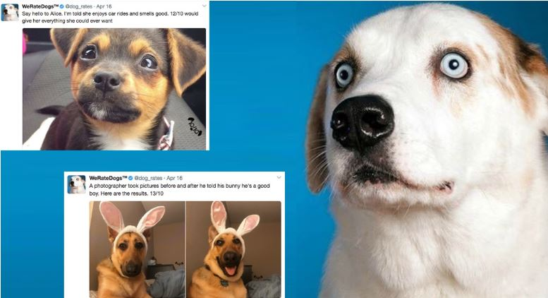
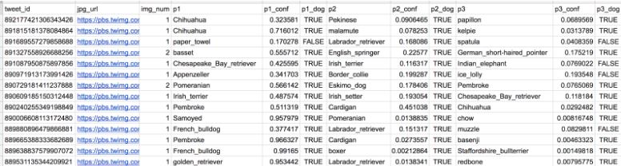

# Data Wrangling and Analyzing of Twitter Data
# Table of Contents
1. Introduction
2. Prerequisites
3. File Description
4. Data Gathering
5. Data Assessment
6. Data Cleaning
7. Results
8. Summary

  
   
 Source: via Boston Magazine 

# Introduction
**In this project:**
- I have gathered, assessed, cleaned and analyzed data of over 5000+ tweets of the Twitter account [WeRateDogs]("https://twitter.com/dog_rates?lang=de"). 
- The data is gathered manually, programmatically and queried using Twitter API via tweepy. 
- The data is assessed for 14 data quality and 4 data tidiness issues and is cleaned to obtain a master dataset
- The cleaned dataset is analyzed to answer 4 questions 

**Questions addressed:**
1. Which breed is the most popular among WeRateDogs tweets and retweets?
2. How is the account activity throughout the time period available in the dataset?
3. What are the most active hours for the twitter account?
4. Which is the most common source used to post the tweets?

  
   
 A golden retriever named Stuart 

# Prerequisites
1. Pandas (for data loading and analysis)
2. NumPy (for computing)
3. Matplotlib (for visualizations)
4. Seaborn (for visualizations)
5. Tweepy (for querying twitter data)
6. json (for additional tweet data)
7. Requests (for programmatic download)
8. Jupyter (to run notebooks)

# File Description
There are three folders:
1. Code
   - Twitter_Data_Analysis.ipynb- covers the data wrangling and analysis process performed to investigate the Twitter handle dataset 
   - Twitter_Data_Analysis.html: HTML file of code to view it in browser
2. Data
   - tweet-archive-enhanced: Twitter archive data of 5000+ tweets
   - tweet_json.txt: Each tweet's json data separated by line
   - image_predictions.tsv: Dog classifications via image prediction
   - twitter_archive_master: Master Dataset
3. Documentation
   - data_analysis_report: Covers the analysis of 4 questions with visualiztions
   - wrangling_steps: Data Wrangling steps performed
4. Images 
   - fig1.png-fig17.png: Visualizations in data analysis part
   - doggo1.jpg and doggo2.jpg: Dog images from WeRateDogs account
   - tweet_predict.jpg: Image prediction file

# Data Gathering
**1. WeRateDogs™ Twitter Archive (twitter-archive-enhanced.csv)**
I commenced the data gathering process by manual download of the twitter archive file which contains basic tweet data for all 5000+ of their tweets. Now the file can be loaded directly into a dataframe using Pandas. It includes attributes related to timestamp, source, tweet text, ratings, dog classifications and retweets information.

**2. Tweet image predictions (image_predictions.tsv)**
To gather this data file I first defined the source url where this file resides. Then I used the requests method to get the file from the source and then stored the contents of the response in a tsv file name image_predictions.tsv. It includes attributes related to image url, three classifications, confidence levels for each and a boolean value to indicate whether the image is of a dog.

  
   
 Tweet Image Prediction Data 

**3. Additional Twitter data using Tweepy API (tweet_json.txt)**
To gather the data from the Twitter API I created a Twitter developer account and gathered the data via tweepy API. This results in a new file called tweet_json.txt. This includes additional tweet data related to favorite counts, retweet counts and tweet text length.

# Data Assessment
Assessing quality and tidiness issues of the data.
## Assessing Summary
### Data Quality Issues (Content)

##### `df_twitter` table
- Datatype of `tweet_id` is integer and should be string
- Datatype of `timestamp` is object and should be datetime
- Some of the dogs are not classified in one of the stages: `doggo, floofer, pupper or puppo` and contain the value "None" under these columns
- Some of the dog names are incorrect (None, an, by, a, ...)
- Presence of retweets
- Some of the ratings are not correctly extracted (mostly if there are >1  occurence of the pattern "(\d+(\.\d+)?\/\d+(\.\d+)?)")
- Mistakes due to transformation of ratings to integer (there are also floats)
- `Source` contains html code

##### `df_predict` table
- Datatype of `tweet_id` is integer and should be string
- Presence of retweets (duplicated rows in column `jpg_url`)
- Presence of pictures that are not dogs
- Predictions are sometimes uppercase, sometimes lowercase
- "_" instead of a whitespace in the predictions

##### `df_api` table
- Datatype of `tweet_id` is integer and should be string

### Data Tidiness Issues (Structural)

##### `df_twitter` table
- `doggo`, `floofer`,`pupper` and `puppo` are not easy to analyze and should be in one column under `dog_stage`

##### `df_predict` table
- Prediction and confidence columns should be reduced to two columns - one for the prediction with the highest confidence (dog)

##### `df_api` table
- `display_text_range` contains 2 variables

##### `All` tables (Master Dataset)

- All three tables share the column `tweet_id` and should be merged together

## Data Cleaning

Cleaning steps:
1. Merge the tables together
2. Drop the `replies, retweets` and corresponding columns. Also drop the tweets without an image or with images which don't display dogs
3. Clean the datatypes of the columns
4. Clean the wrong ratings numerators
     - Replace float values 
     - Drop multiple occurences of patterns
5. Extract the source from html code
6. Split the `display_text_range` into two separate columns
7. Transform the `doggo`, `floofer`, `pupper` and `puppo` columns into one column namely `dog_stage`
8. Remove the incorrect names in the  `name` column
9. Reduce the prediction columns into two: Most likely `breed` and corresponding `confidence`
10. Clean the new `breed` column by replacing the "_" with a whitespace and convert to lowercase

# Results
1. Which breed is the most popular among WeRateDogs tweets and retweets? 
**Insight:** Labrador retriever.   

2. How is the account activity throughout the time period available in the dataset? 
**Insight:** The number of tweets per month decreased, while the retweets and favorites show an uptrend. For the image numbers there is no clear trend visible, the length of the tweets got a little bit closer to the maximum of 130 in the second half of the dataset.   

3. What are the most active hours for the twitter account? 
**Insight:** Here we found that between 5 and 15 'o clock there are nearly no tweets at all. The most tweets are during the time from 0 - 4 and then from 15 - 23, but from 15 - 23 are less tweets than between 0 - 4.  

4. Which is the most common source used to post the tweets? 
**Insight:** Twitter iPhone is the most common source utilized by WeRateDogs account.

# Summary
- Explored the data wrangling process and further analysed the dataset to give insights about 4 questions.
- Executed all the data wrangling steps involving gathering, assessing and cleaning the dataset to augment the data analysis step.
- Gathered the data from 3 sources namely, manual download of twitter archive data, use of requests library for programmatic download of image predictions and use of Tweepy API to get additional data for the tweets
- Assessed the data both visually and programmatically to identify data quality and data tidiness issues
- Cleaned the issues based on the priority of their dimensions
- Made a clean master dataset of WeRatesDogs twitter handle
